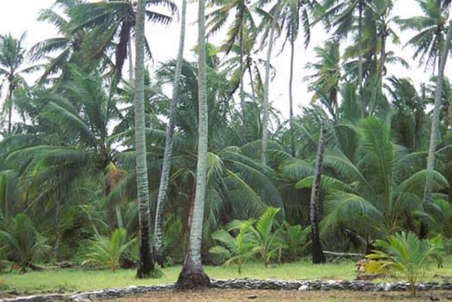

    <h2 class="section-title">{}</h2>
    <ul class="rule-list">
        <li>ドメインは.cc</li>
        <li>ココヤシの木がどこでも栽培されており道端に実か殻のようなものも落ちている</li>
        <li>Google Carが特徴的で右前になにか付いている</li>
    </ul>

{}
{}

{}
ココヤシの木がどこでも栽培されており道端にココナッツの実か殻のようなものも落ちていることも多い{}。
{}

{}
Google Carが特徴的で右前になにか付いている{}がすべての場所でこれが見えるわけではない。また稀に{}でも似た車を使っている場所がある{}点に注意。
{}

{}
浸食を防ぐための土嚢が海沿いに積まれている{}
{}

{}
大型車両はほとんど存在せずバギーのような乗り物が多い。離島であるカリフォルニア州のサンタ・カタリナ島{}や{}もバギーが多い。
{}

<iframe src="https://www.google.com/maps/embed?pb=!4v1693802173605!6m8!1m7!1s0MbiYFIp0B9KFSNVk7k6BA!2m2!1d-12.11801584447531!2d96.89675621233285!3f82.80349905893745!4f9.378870757304867!5f0.4000000000000002" width="600" height="300" style="border:0;" allowfullscreen="" loading="lazy" referrerpolicy="no-referrer-when-downgrade"></iframe>

{}
{}